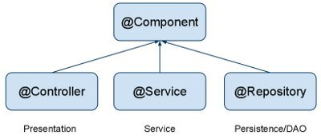

# Component-scan

컴포넌트 스캔(component-scan)이란 빈으로 등록 될 준비를 마친 클래스들을 스캔하여, 빈으로 등록해주는 것이다. 우리가 @Controller, @Service, @Component, @Repository 어노테이션을 붙인 클래스들이 빈으로 등록 될 준비를 한 것이다.  
컴포넌트 스캔은 기본적으로 @Component 어노테이션을 빈 등록 대상으로 포함하는데, @Controller나 @Service 어노테이션도 인식되는 모습을 볼 수 있다. 그 이유는 @Controller나 @Service가 @Component를 포함하고 있기 때문이다.

## Component-scan 사용 방법

### 1. xml 파일에 설정

```xml
<context:component-scan base-package="com.rcod.lifelog"/>
```

다음과 같이 xml 파일에 설정하고, base package를 적어주면 base package 기준으로 클래스들을 스캔하여 빈으로 등록한다.  
base package에 여러개의 패키지를 쓸 수 있다.

```xml
<context:component-scan base-package="com.rcod.lifelog, com.rcod.example"/>
```

위와 같이 설정하면, base pacakage 하위의 @Controller, @Service, @Repository, @Component 클래스가 모두 빈으로 등록되므로, 특정한 객체만 빈으로 등록하여 사용하고 싶다면 include-filter나 exclude-filter를 통해 설정할 수 있다.

- exclude-filter

```xml
<context:component-scan base-package="com.rcod.lifelog"> <context:exclude-filter type="annotation" expression="org.springframework.stereotype.Controller"/> </context:component-scan>
```

- include-filter

```xml
<context:component-scan base-package="com.rcod.lifelog" use-default="false"> <context:include-filter type="annotation" expression="org.springframework.stereotype.Controller"/> </context:component-scan>
```

use-default="false"는 기본 어노테이션 @Controller, @Component등을 스캔하지 않는다는 것이다.  
기본 어노테이션을 스캔하지 않는다고 설정하고, include-filter를 통해서 위와 같이 특정 어노테이션만 스캔할 수 있다.

### 2. 자바 파일 내에서 설정

```java
@Configuration
@ComponentScan(basePackages = "com.rcod.lifelog")
public class ApplicationConfig {
    ...
}
```

@Configuration 은 이 클래스가 xml을 대체하는 설정 파일임을 알려준다.
해당 클래스를 설정 파일로 설정하고 @ComponentScan을 통하여 basePackages를 설정해준다.

위와 같이 component-scan을 사용하는 두 가지 방법이 있다. 만약 component-scan을 사용하지 않으면, 빈으로 설정할 클래스들을 우리가 직접 xml 파일에 일일이 등록해 주어야 한다. 하지만 이 방법은 코드가 매우 길어지고, 일일이 추가하기에 복잡해진다.

## component-scan 동작 과정

#### 1. Configuration 파싱

ConfigurationClassParser 가 Configuration 클래스를 파싱한다.

#### 2. ComponentScan 설정 내역을 파싱한다.

개발자는 basePackages, basePackesClasses, excludeFilters, includeFilters, lazyInit, nameGenerator, resourcePattern, scopedProxy 등 컴포넌트들을 스캔하기 위한 설정을 할 것이다. ComponentScanAnnotationParser가 컴포넌트 후보를 모두 찾고, 스캔하기 위하여 해당 설정을 파싱하여 가져온다.

#### 3. Class 로딩

위의 basePackage 설정을 바탕으로 모든 클래스를 로딩해야 한다. ( \*.class )클래스로더를 이용하여 모든 자원을 Resource 인터페이스 형태로 불러온다.

#### 4. 빈 정의 설정

클래스 로더가 로딩한 리소스(클래스)를 BeanDefinition으로 정의해놓는다. 그리고 beanName의 key값으로 BeanDefinitionRegistry에 등록해 놓는다. 생성할 빈에 대한 정의(메타데이터 같은)라고 보면 될것 같다.

#### 5. 빈 생성 & 주입

다시 처음으로 돌아가 AbstractApplicationContext에서 보이는 finishBeanFactoryInitialization(beanFactory); 메소드에서 빈을 생성한다.위에서 설정한 빈 정의를 바탕으로 객체를 생성하고, 주입한다.

#### 정리

쉽게 설명해서Configuration 클래스 및 Annotation에 사용하는 설정들을 파싱한다. 그리고 basePackage 밑의 모든 .class 자원을 불러와서 component 후보인지 확인하여 BeanDefinition (빈 생성을 위한 정의)을 만든다. 생성된 빈 정의를 바탕으로 빈을 생성하고 의존성있는 빈들을 주입한다.

## anotation 정리



**@Component:** Spring에서 관리되는 객체임을 표시하기 위해 사용하는 가장 기본적인 annotation이다. 즉, scan-auto-detection과 dependency injection을 사용하기 위해서 사용되는 가장 기본 어노테이션이다.

**@Controller:** 해당 클래스를 스프링 MVC 모듈의 컨트롤러로 인식하게 해준다. @RequestMapping 어노테이션을 해당 어노테이션 밑에서만 사용할 수 있다.

**@Repository:** 해당 클래스를 스프링 데이터 접근 계층으로 인식하고, 데이터 계층의 예외를 한 단계 추상화하여 스프링 예외로 변환시켜 던져준다. (스프링의 DataAccessException) 이로 인해 db마다 다른 예외가 일어나도 서비스 단에 영향을 끼치지 않게 된다.

**@Service:** 이 어노테이션은 특별한 처리를 해주는 것은 아니지만, 개발자들에게 명시적으로 비즈니스 로직을 처리하는 클래스하는 것을 보여준다.

## 예상 질문

- component-scan의 동작 과정에 대해 설명해주세요.

## 참고 링크

https://yenbook.tistory.com/26
