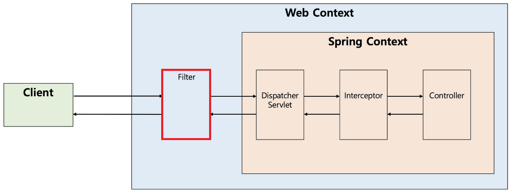
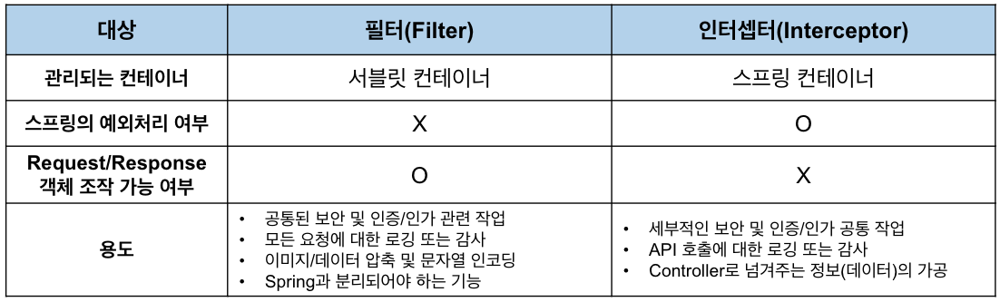

# 필터(Fiter) vs 인터셉터(Interceptor)

자바 웹 개발을 하다보면, 공통적으로 처리해야 할 업무들이 많다.

예를들어 로그인 관련(세션체크)처리, 권한체크, XSS(Cross site script)방어, pc와 모바일웹의 분기처리, 로그, 페이지 인코딩 변환 등이 있다.

공통업무에 관련된 코드를 모든 페이지 마다 작성 해야한다면 중복된 코드가 많아지게 되고 프로젝트 단위가 커질수록 서버에 부하를 줄 수도 있으며, 소스 관리도 되지 않는다.

즉, 공통 부분은 빼서 따로 관리하는게 좋다.

이러한 공통업무를 프로그램 흐름의 앞, 중간, 뒤에 추가하여 자동으로 처리할 수 있는 방법이 3가지가 있다.

스프링에서 사용되는 Filter, Interceptor, AOP 세 가지 기능은 모두 무슨 행동을 하기전에 먼저 실행하거나, 실행한 후에 추가적인 행동을 할 때 사용되는 기능들이다.

## 필터(Filter)

필터는 스프링이 지원하는 기능이 아닌, J2EE 표준 스펙의 기능이다. 가장 앞단에 존재하는 프론트 컨트롤러인 디스패처 서블릿(Dispatcher Servlet)에 요청이 전/후에 부가적인 작업을 처리할 수 있는 기능을 제공한다.



다음과 같은 흐름으로 동작한다.  
HTTP 요청  ->  WAS ->  필터 ->  서블릿 ->  컨트롤러  
필터체인: HTTP 요청 -> WAS -> 필터 1 ~ N  -> 서블릿 -> 컨트롤러

필터를 구현할 땐 javax.servlet의 Filter 인터페이스를 사용한다.Filter 인터페이스의 구조는 다음과 같다.

```java
public interface Filter {

    public default void init(FilterConfig filterConfig) throws ServletException {}

    public void doFilter(ServletRequest request, ServletResponse response,
            FilterChain chain) throws IOException, ServletException;

    public default void destroy() {}

}
```

init 메서드: 필터 객체를 초기화하고 서비스에 추가하기 위해 사용  
doFilter 메서드: 필터 처리를 구현할 수 있으며 FilterChain 파라미터를 사용하여 다음 필터로 요청을 넘길 수 있음  
destroy 메서드: 필터를 제거하고 자원을 반환하기 위해 사용

## 인터셉터

인터셉터의 경우 스프링 MVC가 제공하는 기능이다. 아래의 사진과 같이 필터 이후 실행되며 디스패처 서블릿과 컨트롤러 사이에서 컨트롤러 호출 전에 호출된다. HandlerMapping을 지나 인터셉터가 존재한다면 인터셉터를 실행하고 없는 경우 바로 컨트롤러를 호출한다.

다음과 같은 흐름으로 동작한다.
HTTP 요청 -> WAS -> 필터 -> 서블릿 -> 스프링 인터셉터 -> 컨트롤러  
인터셉터 체인 : HTTP 요청 -> WAS -> 필터 -> 서블릿 -> 스프링 인터셉터1 ~ N -> 컨트롤러

인터셉터의 경우 HandlerInterceptor 인터페이스를 구현하면 된다.HandlerInterceptor 인터페이스의 구조는 다음과 같다.

```java
public interface HandlerInterceptor

    default boolean preHandle(HttpServletRequest request, HttpServletResponse response, Object handler)
	throws Exception {
        return true;
    }

    default void postHandle(HttpServletRequest request, HttpServletResponse response,
	Object handler, @Nullable ModelAndView modelAndView) throws Exception {
    }

    default void afterCompletion(HttpServletRequest request, HttpServletResponse response,
	Object handler, @Nullable Exception ex) throws Exception {
    }
}
```

필터의 기능 구현은 doFilter 하나로 수행하지만 인터셉터의 경우 3단계로 구성된다.

1. preHandle : 반환 타입이 boolean 타입으로 true일 경우 계속 진행하고 false일 경우 진행을 멈춘다. ( 컨트롤러 호출 전에 실행된다 )

2. postHandle : HandlerAdaptor 호출 후에 실행된다 ( 컨트롤러가 호출된 후에 실행된다 )

3. afterCompletion : 요청이 완료된 후 실행되며 뷰가 렌더링 된 후에 실행된다.

## 필터와 인터셉터의 차이 및 용도



### 관리되는 컨테이너

앞서 살펴본 그림에서 보이듯이 필터와 인터셉터는 관리되는 영역이 다르다. 필터는 스프링 이전의 서블릿 영역에서 관리되지만, 인터셉터는 스프링 영역에서 관리되는 영역이기 때문에 필터는 스프링이 처리해주는 내용들을 적용 받을 수 없다. 이로 인한 차이로 발생하는 대표적인 예시가 스프링에 의한 예외처리가 되지 않는다는 것이다.  
참고로 일부 포스팅 또는 자료에서 필터(Filter)가 스프링 빈으로 등록되지 못하며, 빈을 주입 받을 수도 없다고 하는데, 이는 잘못된 설명이다. 이는 매우 옛날의 이야기이며, 필터는 현재 스프링 빈으로 등록이 가능하며, 다른 곳에 주입되거나 다른 빈을 주입받을 수도 있다.

### 스프링 예외 처리 여부

일반적으로 스프링을 사용한다면 ControllerAdvice와 ExceptionHandler를 이용한 예외처리 기능을 주로 사용한다. 예를 들어 원하는 멤버를 찾지 못하여 로직에서 MemberNotFoundException을 던졌다면 404 Status로 응답을 반환하길 원할 것이다.  
하지만 앞서 설명하였듯 필터는 스프링 앞의 서블릿 영역에서 관리되기 때문에 스프링의 지원을 받을 수 없다. 그래서 만약 필터에서  MemberNotFoundException이 던져졌다면, 에러가 처리되지 않고 서블릿까지 전달된다. 서블릿은 예외가 핸들링 되기를 기대했지만, 예외가 그대로 올라와서 예상치 못한 Exception을 만난 상황이다. 따라서 내부에 문제가 있다고 판단하여 500 Status로 응답을 반환한다. 이를 해결하려면 필터에서 다음과 같이 응답(Response) 객체에 예외 처리가 필요하다.

### Request/Response 객체 조작 가능 여부

필터는 Request와 Response를 조작할 수 있지만 인터셉터는 조작할 수 없다. 여기서 조작한다는 것은 내부 상태를 변경한다는 것이 아니라 다른 객체로 바꿔친다는 의미이다. 이는 필터와 인터셉터의 코드를 보면 바로 알 수 있다.  
필터가 다음 필터를 호출하기 위해서는 필터 체이닝(다음 필터 호출)을 해주어야 한다. 그리고 이때 Request/Response 객체를 넘겨주므로 우리가 원하는 Request/Response 객체를 넣어줄 수 있다. NPE가 나겠지만 null로도 넣어줄 수 있는 것이다.

```java
public MyFilter implements Filter {

public void doFilter(ServletRequest request, ServletResponse response, FilterChain chain) {
    // 개발자가 다른 request와 response를 넣어줄 수 있음
    chain.doFilter(new MockHttpServletRequest(), new MockHttpServletResponse());
}

}
```

하지만 인터셉터는 처리 과정이 필터와 다르다. 디스패처 서블릿이 여러 인터셉터 목록을 가지고 있고, for문으로 순차적으로 실행시킨다. 그리고 true를 반환하면 다음 인터셉터가 실행되거나 컨트롤러로 요청이 전달되며, false가 반환되면 요청이 중단된다. 그러므로 우리가 다른 Request/Response 객체를 넘겨줄 수 없다. 그리고 이러한 부분이 필터와 확실히 다른 점이다.

```java
public class MyInterceptor implements HandlerInterceptor {

default boolean preHandle(HttpServletRequest request, HttpServletResponse response, Object handler) {
    // Request/Response를 교체할 수 없고 boolean 값만 반환할 수 있다.
    return true;
}

}
```

### 필터와 인터셉터의 용도 및 예시

**- 필터**  
 필터에서는 기본적으로 스프링과 무관하게 전역적으로 처리해야 하는 작업들을 처리할 수 있다.
대표적으로 보안 공통 작업이 있다. 필터는 인터셉터보다 앞단에서 동작하므로 전역적으로 해야하는 보안 검사(XSS 방어 등)를 하여 올바른 요청이 아닐 경우 차단을 할 수 있다. 그러면 스프링 컨테이너까지 요청이 전달되지 못하고 차단되므로 안정성을 더욱 높일 수 있다.  
 또한 필터는 이미지나 데이터의 압축이나 문자열 인코딩과 같이 웹 애플리케이션에 전반적으로 사용되는 기능을 구현하기에 적당하다. Filter는 다음 체인으로 넘기는 ServletRequest/ServletResponse 객체를 조작할 수 있다는 점에서 Interceptor보다 훨씬 강력한 기술이다.

**- 인터셉터**  
 인터셉터에서는 클라이언트의 요청과 관련되어 전역적으로 처리해야 하는 작업들을 처리할 수 있다.  
 대표적으로 세부적으로 적용해야 하는 인증이나 인가와 같이 클라이언트 요청과 관련된 작업 등이 있다. 예를 들어 특정 그룹의 사용자는 어떤 기능을 사용하지 못하는 경우가 있는데, 이러한 작업들은 컨트롤러로 넘어가기 전에 검사해야 하므로 인터셉터가 처리하기에 적합하다.  
 또한 인터셉터는 필터와 다르게 HttpServletRequest나 HttpServletResponse 등과 같은 객체를 제공받으므로 객체 자체를 조작할 수는 없다. 대신 해당 객체가 내부적으로 갖는 값은 조작할 수 있으므로 컨트롤러로 넘겨주기 위한 정보를 가공하기에 용이하다. 예를 들어 사용자의 ID를 기반으로 조회한 사용자 정보를 HttpServletRequest에 넣어줄 수 있다.  
 그 외에도 우리는 다양한 목적으로 API 호출에 대한 정보들을 기록해야 할 수 있다. 이러한 경우에 HttpServletRequest나 HttpServletResponse를 제공해주는 인터셉터는 클라이언트의 IP나 요청 정보들을 포함해 기록하기에 용이하다.

**- 요약**  
 인코딩이나 보안 관련 처리와 같은 web app의 전역적으로 처리해야 하는 로직은 필터로 구현하고 클라이언트에서 들어오는 디테일한 처리(인증, 권한 등)에 대해서는 주로 인터셉터에서 처리한다.

## 예상 질문

- Spring filter와 Intercepter의 차이점은 무엇인가요?

## 참고 링크

https://geminihoroscope.tistory.com/104  
https://mozzi-devlog.tistory.com/9  
https://mangkyu.tistory.com/173
