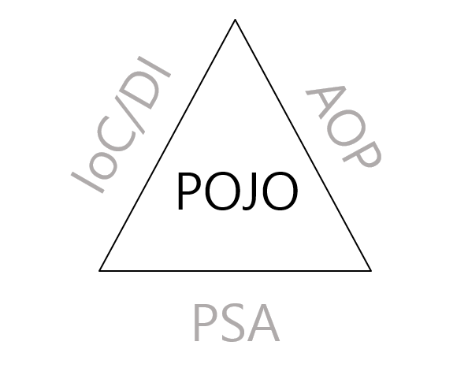

# POJO (Plain Old Java Object)



위 이미지는 Spring 삼각형이라는 유명한 이미지로 Spring의 핵심 개념들을 모두 표현하고 있다.
POJO는 IoC/DI, AOP, PSA를 통해서 달성할 수 있다는 것을 의미한다.

POJO란 Plain Old Java Object의 약자로, 이를 직역하면 순수한 오래된 자바 객체이다.
즉, Java로 생성하는 순수한 객체를 뜻한다.

이를 해석하면 POJO는 객체 지향적인 원리에 충실하면서 환경과 기술에 종속되지 않고, 필요에 따라 재활용될 수 있는 방식으로 설계된 오브젝트를 의미한다.
이러한 POJO에 애플리케이션의 핵심 로직과 기능을 담아 설계하고 개발하는 방법을 POJO 프로그래밍이라고 한다.

## POJO 프로그래밍

POJO 프로그래밍은 POJO를 이용하여 프로그래밍 코드를 작성하는 것이다.  
그러나 순수 자바 객체만을 사용한다고 해서 POJO 프로그래밍이라고 볼 수는 없다.  
POJO 프로그래밍으로 작성한 코드가 되기 위해서는 기본적인 규칙들을 지켜야 한다.

**1. Java나 Java의 스펙에 정의된 것 이외에는 다른 기술이나 규약에 얽매이지 않아야 한다.**  
다음 코드는 getter와 setter만 가지고 있는 코드의 에제이다.

```java
public class User {
    private String userName;
    private String id;
    private String password;

    public String getUserName() {
        return userName;
    }

    public void setUserName(String userName) {
        this.userName = userName;
    }

    public String getId() {
        return id;
    }

    public void setId(String id) {
        this.id = id;
    }

    public String getPassword() {
        return password;
    }

    public void setPassword(String password) {
        this.password = password;
    }
}
```

위 코드는 자바에서 제공하는 기능만 사용하기 때문에 해당 클래스는 Java 언어 이외의 특정한 기술에 종속되어 있지 않은 순수한 객체이기 때문에 POJO라고 부를 수 있다.

```java
public class MessageForm extends ActionForm {
    String message;

    public String getMessage() {
        return message;
    }

    public void setMessage(String message) {
        this.message = message;
    }
}

public class MessageAction extends Action {
    public ActionForward execute(ActionMapping mapping, ActionForm form,
        HttpServletRequest request, HttpServletResponse response)
        throws Exception {

        MessageForm messageForm = (MessageForm) form;
        messageForm .setMessage("Hello World");

        return mapping.findForward("success");
    }
}
```

ActionForm 클래스는 과거에 Struts라는 웹 프레임워크에서 지원하는 클래스이다.  
MessageForm 클래스는 Struts라는 기술을 사용하기 위해 ActionForm 클래스를 상속받고 있다.  
또한, MessageAction 클래스에서 역시 Struts 기술의 Action 클래스를 상속받고 있다.

이러한 방식으로 기술을 상속받아 코드를 작성하게 되면, 애플리케이션의 요구사항이 변경되어 다른 기술로 변경해야 할 때 Struts의 클래스를 명시적으로 사용했던 부분들을 모두 제거하여 수정해야 한다.

또한, Java는 다중 상속을 지원하지 않기 때문에 extends 키워드를 통해 상속을 받게 되면 상위 클래스를 상속받아 하위 클래스를 확장하는 객체지향 설계 기법을 적용하기 어려워진다.

**2. 특정 환경에 종속적이지 않아야 한다.**  
이는 특정한 프레임워크에서만 동작이 가능하면 안된다는 의미를 가진다. POJO는 환경에 독립적이어야 한다. 특히, 비즈니스 로직을 담고 있는 POJO 클래스는 웹 기반의 환경 정보나 웹 기술을 담고 있는 클래스 또는 인터페이스를 사용하면 안된다.

웹 컨트롤러와 연결하여 사용하더라도, 직접적으로 사용 환경을 웹으로 제한하거나 웹에서만 동작하는 API를 직접 사용하지 말아야 한다. 이러한 이유는 웹 이외의 클라이언트는 해당 기능을 요청할 수 없기 때문이다.
따라서 비즈니스 로직을 담는 코드에 HTTPServletRequest, HttpSession, 캐시 등에 관련된 API를 사용하게 된다면 POJO라 할 수 없다.

서블릿(Servlet) 기반의 웹 애플리케이션을 실행시키는 서블릿 컨테이너(Servlet Contatiner)인 아파치 톰캣(Apache Tomcat)을 예로 들어
순수 Java로 작성한 애플리케이션 코드 내에서 Tomcat이 지원하는 API를 직접 가져다가 사용한다고 가정한다.

이후 시스템의 요구 사항이 변경되어 톰캣에서 Zetty라는 다른 서블릿 컨테이너를 사용하게 된다면,
애플리케이션 코드에서 사용하고 있는 Tomcat API 코드들을 모두 제거하고 Zetty로 수정해야 한다.
최악의 경우 애플리케이션을 전부 수정해야 하는 상황에 직면할 수도 있다.

따라서, Java 이외의 다른 기술에 얽매이지 않으며, 특정 환경에 종속적이지 다른 않아야 POJO 프로그래밍이라고 할 수 있다.

## POJO 프로그래밍이 필요한 이유

스프링 프레임워크 이전에는 원하는 엔터프라이즈 기술이 있다면 그 기술을 직접적으로 사용하는 객체를 설계했다. 그리고 이러한 개발 방식이 만연했었다. 특정 기술과 환경에 종속되어 의존하게 된 자바 코드는 가독성이 떨어져 유지보수에 어려움이 생겼다. 또한 특정 기술의 클래스를 상속받거나, 직접 의존하게 되어 확장성이 매우 떨어지는 단점이 있었다.

이 말은 자바가 객체지향 설계의 장점들을 잃어버리게 것이다. 그래서 본래 자바의 장점을 살리는 POJO라는 개념이 등장했다.

Spring의 경우 JPA라는 표준 인터페이스를 정함으로써, 여러 ORM 프레임워크들이 이 JPA라는 표준 인터페이스 아래, 구현되어 실행되게 만들었다. 이러한 방법으로 Spring은 새로운 엔터프라이즈 기술을 도입하면서도 POJO를 유지할 수 있게 됐다.

## POJO 프로그래밍의 특징

- 특정 환경이나 기술에 종속적이지 않으면 재사용이 가능하고, 확장 가능한 유연한 코드를 작성할 수 있다.
- 저수준 레벨의 기술과 환경에 종속적인 코드를 제거하여 코드를 간결해지며 디버깅하기에도 상대적으로 쉬워진다.
- 특정 기술이나 환경에 종속적이지 않기 때문에 테스트가 단순해진다.
- **객체지향적인 설계를 제한 없이 적용할 수 있다.**

Spring은 POJO 프로그래밍을 지향하는 프레임워크이다.
최대한 다른 환경이나 기술에 종속적이지 않도록 하기 위한 POJO 프로그래밍 코드를 작성하기 위해 Spring 프레임워크에서는 IoC/DI, AOP, PSA를 지원하고 있다.

## 예상 질문

- POJO란 무엇인지 설명하고, POJO 프로그래밍이 필요한 이유를 설명해 주세요.

## 참고 링크

https://ittrue.tistory.com/211
https://siyoon210.tistory.com/120
