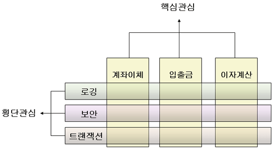
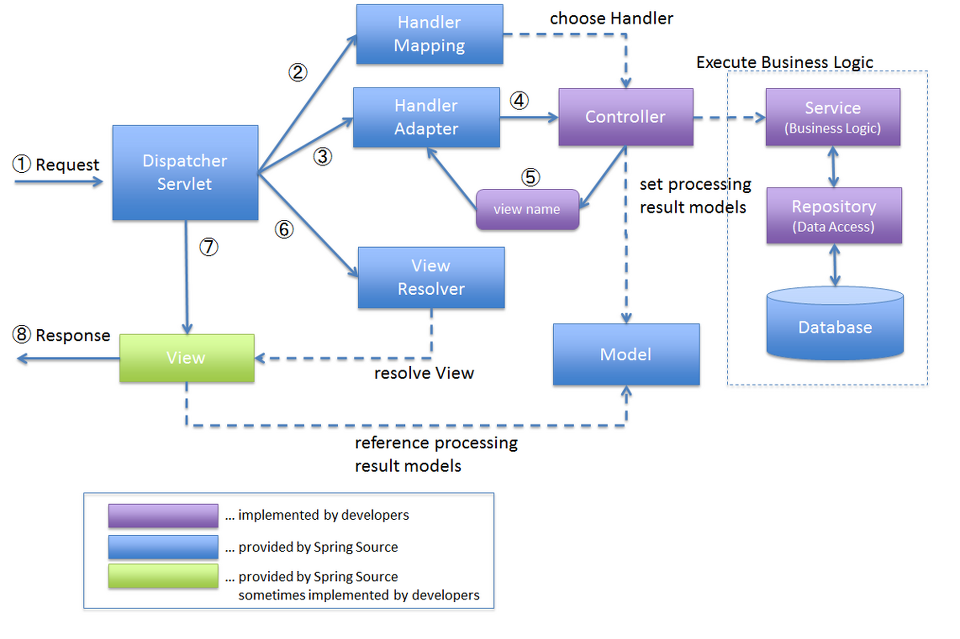

# Spring Framework

## Spring

Spring framework란 자바의 오픈소스 애플리케이션 프레임워크 중 하나이다. 스프링의 기본철학은 특정 기술에 종속되지 않고 객체를 관리할 수 있는 프레임워크를 제공하는 것이다.  
스프링 컨테이너로 자바 객체를 관리하면서 DI와 IoC를 통해 결합도를 낮추게 된다.

### 주요 특성

#### 1. 경량 컨테이너로서 자바 객체를 직접 관리

- 각각의 객체 생성, 소멸과 같은 라이프 사이클을 관리하며 스프링으로부터 필요한 객체를 얻어올 수 있다.

#### 2. POJO(Plain Old Java Object) 방식의 프레임워크

- 스프링에서 생성되어 관리되는 POJO 기반의 객체를 Spring Bean이라고 한다.  
  여기서 POJO는 단순 getter, setter만으로 구성되어 있으며 단순히 new를 통해서 생성 가능한 형태를 말한다.
- 핵심은 특정 기술에 종속되는 어떤 클래스도 상속하지 않고 있고, 어떠한 인터페이스도 구현하고 있지 않은 자바 클래스라는 것이다.

- 특정 기술과 환경에 종속되지 않은 오브젝트이기 때문에 코드가 깔끔해지고, 유지보수하기에 좋아진다.

#### 3. IoC (Inversion of Control) 지원

- IoC는 제어의 역전을 의미한다. 제어권이 개발자에게 있지 않고, 프레임워크에 있어서 필요에 따라서 사용자의 코드를 호출한다.  
  스프링에서는 인스턴스의 생성부터 소멸까지 개발자가 아닌 컨테이너에서 대신 관리하게 된다. (개발자들이 직접 POJO를 생성할 수 있지만 컨테이너에게 맡긴다)

#### 4. DI (Depedency Injection) 지원

- DI는 의존성 주입을 의미한다. 의존성 주입은 필요한 객체를 직접 생성하는 것이 아닌 외부로부터 객체를 받아서 사용하는 것을 의미한다.

- 의존성 주입을 해야 하는 이유
  - 테스트가 용이해진다.
  - 코드의 재사용성을 높여준다.
    객체 간의 의존성(종속성)을 줄이거나 없앨 수 있다.
  - 객체 간의 결합도를 낮추면서 유연한 코드를 작성할 수 있다.
- 의존성 주입의 3가지 방법

  a) 생성자 주입(Constructor Injection)

```java
@Controller
public class CocoController {
  //final을 붙일 수 있음
    private final CocoService cocoService;
  //---------------------------------------------------------
  //@Autowired
    public CocoController(CocoService cocoService) {
        this.cocoService = cocoService;
    }
}
```

클래스의 생성자가 하나이고, 그 생성자로 주입받을 객체가 빈으로 등록되어 있다면  @Autowired를 생략 할 수 있다.

b) 필드 주입(Field Injection)

```java
@Controller
public class CocoController {

    @Autowired
    private CocoService cocoService;
}
```

필드에 @Autowired 어노테이션만 붙여주면 자동으로 의존성 주입된다.

코드가 간결하지만, 외부에서 변경하기 힘들다.  
프레임워크에 의존적이고 객체지향적으로 좋지 않다.

c) 수정자 주입(Setter Injection)

```java
@Controller
public class CocoController {
    private CocoService cocoService;

    @Autowired
    public void setCocoService(CocoService cocoService) {
    	this.cocoService = cocoService;
    }
}
```

Setter 메소드에 @Autowired 어노테이션을 붙이는 방법이다.

**+어떤 주입 방식을 사용하는 게 좋을까?**

Spring Framwork reference에서 권장하는 방법은 생성자를 통한 주입이다. 그 이유는 다음과 같다.

a) 순환 참조를 방지할 수 있다.

- 필드 주입과 수정자 주입은 빈이 생성된 후에 참조를 하기 때문에 어플리케이션이 아무런 오류 그리고 경고 없이 구동된다. 그리고 그것은 실제 코드가 호출될 때까지 문제를 알 수 없다는 것이다.  
   반면, 생성자를 통해 주입하고 실행하면 BeanCurrentlyInCreationException이 발생하게 된다.  
   순환 참조 뿐만 아니라 더 나아가서 의존 관계에 내용을 외부로 노출 시킴으로써 어플리케이션을 실행하는 시점에서 오류를 체크할 있다.

b) 불변성을 가진다.

- 생성자로 의존성을 주입할 때 final로 선언할 수 있고, 이로인해 런타임에서 의존성을 주입받는 객체가 변할 일이 없어지게 된다.  
  하지만 수정자 주입이나 일반 메소드 주입을 이용하게되면 불필요하게 수정의 가능성을 열어두게 되고,이는 OOP의 5가지 원칙 중 OCP(Open-Closed Principal, 개방-폐쇄의 원칙)를 위반하게 된다.  
  그러므로 생성자 주입을 통해 변경의 가능성을 배제하고 불변성을 보장하는 것이 좋다.

c) 테스트에 용이하다.

- 독립적으로 인스턴스화가 가능한 POJO(Plain Old Java Object)를 사용하면, DI 컨테이너 없이도 의존성을 주입하여 사용할 수 있다.  
  이를 통해 코드 가독성이 높아지며, 유지보수가 용이하고 테스트의 격리성과 예측 가능성을 높일 수 있다는 장점이 생기게 된다.

#### 5. AOP(Aspect Oriented Programming) 지원

- 트랜잭션이나 로깅, 보안과 같이 공통적으로 사용하는 기능들을 분리하여 관리할 수 있는 것을 말한다. 공통 모듈인 인증, 로깅, 트랜잭션 처리에 용이하다.
- AOP의 가장 큰 특징이자 장점은 중복 코드 제거, 재활용성의 극대화, 변화수용의 용이성이 좋다는 점이다.



## Spring Boot

스프링 부트는 Auto-Configuration 등의 기능으로 스프링 프레임워크의 사용을 돕는 모듈이다. 즉 웹 개발로 스프링을 사용할때 Config 설정을 편하게 하고 싶으면 Spring boot와 함께 사용하는 개념이라고 생각하면 된다.

가장 큰 차이점은 Auto Configuration의 존재 여부이다. Spring은 프로젝트 초기에 다양한 환경설정을 해야 하지만, Spring Boot는 설정의 많은 부분을 자동화하여 사용자가 편하게 스프링을 활용할 수 있도록 돕는다. spring boot starter dependency만 추가해주면 설정은 끝나고, 내장된 톰캣을 제공해 서버를 바로 실행할 수 있다.

Spring boot의 자세한 특징은 아래와 같다.

#### 1. 라이브러리 관리 자동화

- spring-boot-start를 통해 라이브러리 의존성을 간단히 처리할 수 있다.

#### 2. 설정의 자동화

- 프로젝트에 추가된 라이브러리 기반으로 실행환경을 자동 설정해준다.
- 개발에 필요한 라이브러리들을 추가하면 관련 스프링 설정을 자동 처리해준다.

#### 3. 라이브러리 버전 자동 관리

- 스프링 부트 버전에 해당하는 스프링 라이브러리와 서드파티 라이브러리를 호환버전으로 제공
- 라이브러리 버전 문제를 겪을 필요가 없고, XML 설정 과정이 필요없어진다.

#### 4. 테스팅 환경 & 내장 TOMCAT

- JUnit 등 테스트 관련 라이브러리들이 포함되어 있어 테스트케이스 작성이 쉽다.
- Tomcat 서버를 내장하고 있어 따로 설치할 필요가 없다.

#### 5. 독립적으로 실행 가능한 JAR

- 스프링에서는 일반 자바프로젝트를 JAR 파일로, 웹 프로젝트라면 WAR 파일로 패키징 해야한다.
- 부트는 웹 애플리케인셔 JAR 파일로 패키징하여 사용할 수 있다.

## Spring MVC

MVC는 Model, View, Controller의 약자이며, 각 레이어간 기능을 구분하는데 중점을 둔 디자인 패턴이다.

- Model  
  Model은 데이터 관리 및 비즈니스 로직을 처리하는 부분이다. (DAO, DTO, Service 등)

- View  
  View는 비즈니스 로직의 처리 결과를 통해 유저 인터페이스가 표현되는 구간이다. (html, jsp, tymeleaf, mustache 등 화면을 구성하기도 하고, Rest API로 서버가 구현된다면 json 응답으로 구성되기도 한다.)

- Controller  
  Controller는 사용자의 요청을 처리하고 Model과 View를 중개하는 역할을 한다. Model과 View는 서로 연결되어 있지 않기 때문에 Controller가 사이에서 통신 매체가 되어준다.



MVC의 요청 처리 흐름은 다음과 같다.

**DispatcherServlet :** 클라이언트에게 요청을 받아 응답까지의 MVC 처리과정을 통제한다.

**HandlerMapping :** 클라이언트의 요청 URL을 어떤 Controller가 처리할지 결정한다.

**HandlerAdapter :** HandlerMapping에서 결정된 핸들러 정보로 해당 메소드를 직접 호출해주는 역할을 한다.

**ViewResolver :** Controller의 처리 결과(데이터)를 생성할 view를 결정한다.

1. 클라이언트는 URL을 통해 요청을 전송한다.
2. 디스패처 서블릿은 핸들러 매핑을 통해 해당 요청이 어느 컨트롤러에게 온 요청인지 찾는다.
3. 디스패처 서블릿은 핸들러 어댑터에게 요청의 전달을 맡긴다.
4. 핸들러 어댑터는 해당 컨트롤러에 요청을 전달한다.
5. 컨트롤러는 비즈니스 로직을 처리한 후에 반환할 뷰의 이름을 반환한다.
6. 디스패처 서블릿은 뷰 리졸버를 통해 반환할 뷰를 찾는다.
7. 디스패처 서블릿은 컨트롤러에서 뷰에 전달할 데이터를 추가한다.
8. 데이터가 추가된 뷰를 반환한다.

## 예상 질문

- Spring Framework에 대해 설명해주세요.
- 제어의 역전(IoC, Inversion of Control)에 대해 아는대로 설명해주세요.
- 의존성 주입(DI, Dependency Injection)에 대해 설명해주세요.
- Spring Boot와 Spring Framework의 차이점을 설명해주세요.
- Spring MVC에 대해 설명해주세요.
- MVC는 어떠한 흐름으로 요청을 처리하는지 설명해주세요.

## 참고 링크

https://dev-coco.tistory.com/163
https://notspoon.tistory.com/33  
https://finger-ineedyourhelp.tistory.com/64  
https://dev-coco.tistory.com/70  
https://velog.io/@lucaschoi/Spring-vs-Spring-boot-vs-Spring-MVC
