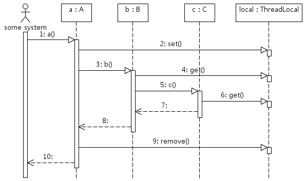

# ThreadLocal

ThreadLocal은 JDK 1.2부터 제공된 오래된 클래스다.

일반 변수의 수명은 특정 코드 블록(예, 메서드 범위, for 블록 범위 등) 범위 내에서만 유효하다.

반면에 ThreadLocal을 이용하면 쓰레드 영역에 변수를 설정할 수 있기 때문에, 특정 쓰레드가 실행하는 모든 코드에서 그 쓰레드에 설정된 변수 값을 사용할 수 있게 된다.

다만 잘못 사용하는 경우 큰 부작용(side-effect)이 발생할 수 있기 때문에 다른 스레드와 변수가 공유되지 않도록 주의해야 한다.

## ThreadLocal 사용법

1. ThreadLocal 객체를 생성한다.
2. ThreadLocal.set() 메서드를 이용해서 현재 쓰레드의 로컬 변수에 값을 저장한다.
3. ThreadLocal.get() 메서드를 이용해서 현재 쓰레드의 로컬 변수 값을 읽어온다.
4. ThreadLocal.remove() 메서드를 이용해서 현재 쓰레드의 로컬 변수 값을 삭제한다.

아래는 기본적인 사용방법이다.

```java
// 현재 쓰레드와 관련된 로컬 변수를 하나 생성한다.
ThreadLocal<UserInfo> local = new ThreadLocal<UserInfo>();

// 로컬 변수에 값 할당
local.set(currentUser);

// 이후 실행되는 코드는 쓰레드 로컬 변수 값을 사용
UserInfo userInfo = local.get();
```

위 코드만으로는 ThreadLocal이 어떻게 동작하는 지 잘 이해가 되지 않을테니, 구체적인 예제를 이용해서 ThreadLocal의 동작 방식을 살펴보도록 하겠다. 먼저 ThreadLocal 타입의 static 필드를 갖는 클래스를 하나 작성해보자.

```java
public class Context {
    public static ThreadLocal<Date> local = new ThreadLocal<Date>();
}
```

이제 Context 클래스를 사용해서 쓰레드 로컬 변수를 설정하고 사용하는 코드를 작성할 차례이다. 아래는 코드의 예이다.

```java
class A {
    public void a() {
        Context.local.set(new Date());

        B b = new B();
        b.b();

        Context.local.remove();
    }
}

class B {
    public void b() {
        Date date = Context.local.get();

        C c = new C();
        c.c();
    }
}

class C {
    public void c() {
        Date date = Context.local.get();
    }
}
```

위 코드를 보면 A, B, C 세 개의 클래스가 존재하는데, A.a() 메서드를 호출하면 다음 그림과 같은 순서로 메서드가 실행된다.  


위 그림에서 1~10은 모두 하나의 쓰레드에서 실행된다. ThreadLocal과 관련된 부분을 정리하면 다음과 같다.

- 2 - A.a() 메서드에서 현재 쓰레드의 로컬 변수에 Date 객체를 저장한다.
- 4 - B.b() 메서드에서 현재 쓰레드의 로컬 변수에 저장된 Date 객체를 읽어와 사용한다.
- 6 - C.c() 메서드에서 현재 쓰레드의 로컬 변수에 저장된 Date 객체를 읽어와 사용한다.
- 9 - A.a() 메서드에서 현재 쓰레드의 로컬 변수를 삭제한다.

위 코드에서 중요한 건 A.a()에서 생성한 Date 객체를 B.b() 메서드나 C.c() 메서드에 파라미터로 전달하지 않는다는 것이다. 즉, 파라미터로 객체를 전달하지 않아도 한 쓰레드로 실행되는 코드가 동일한 객체를 참조할 수 있게 된다.

## threadlocal의 활용

ThreadLocal은 한 쓰레드에서 실행되는 코드가 동일한 객체를 사용할 수 있도록 해 주기 때문에 쓰레드와 관련된 코드에서 파라미터를 사용하지 않고 객체를 전파하기 위한 용도로 주로 사용되며, 주요 용도는 다음과 같다.

- 사용자 인증정보 전파 - Spring Security에서는 ThreadLocal을 이용해서 사용자 인증 정보를 전파한다. (SecurityContext, SecurityContextHolder)
- 트랜잭션 컨텍스트 전파 - 트랜잭션 매니저는 트랜잭션 컨텍스트를 전파하는 데 ThreadLocal을 사용한다.
- 쓰레드에 안전해야 하는 데이터 보관

이 외에도 쓰레드 기준으로 동작해야 하는 기능을 구현할 때 ThreadLocal을 유용하게 사용할 수 있다.

## threadlocal 사용시 주의사항

ThreadLocal은 Thead의 정보를 key로 하여 Map의 형식으로 데이터를 저장한 후 사용할 수 있는 자료구조를 가지고 있다.  
따라서 만약 ThreadPool을 사용하여 thread를 재사용한다면 이전에 세팅했던 ThreadLocal의 정보가 남아있어 원치않는 동작을 할 수 있다. 따라서 ThreadPool을 사용하는 경우에는 반드시 모두 사용 후 ThreadLocal의 값을 remove 메서드를 사용하여 값을 제거해주는것이 필요하다.

- 스레드 풀(Thread Pool)이란?  
  스레드 제어 문제를 해결할 방법으로 스레드 풀을 사용한다. 스레드 풀은 매번 생성 및 수거 요청이 올 때 스레드를 생성하고 수거하는 것이 아닌, 스레드 사용자가 설정해둔 개수만큼 미리 생성해두는 것이다.

## 예상 질문

- JAVA ThreadLocal이란 무엇이며 어떻게 활용되나요?
- ThreadLocal 사용 시 주의사항은 무엇인가요?

## 참고 링크

https://madplay.github.io/post/java-threadlocal
https://javacan.tistory.com/entry/ThreadLocalUsage
https://tecoble.techcourse.co.kr/post/2021-09-18-java-thread-pool/
