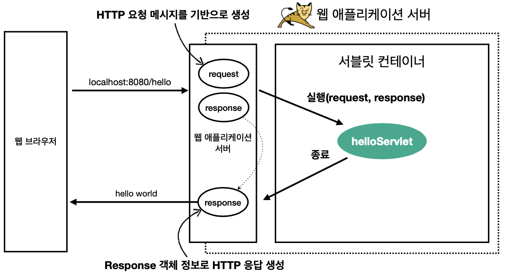
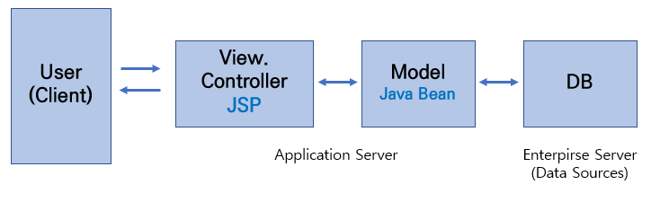

### Web Server 란?

s

**웹 서버란** HTTP 프로토콜을 기반으로 클라이언트로 요청을 받아 그에 해당하는 정적 파일들을 제공하는 소프트웨어입니다. 여기서 정적인 파일들은 HTML, CSS, 이미지 등 즉시 응답이 가능한 자원을 말하며 개발자가 변경하지 않는 이상 항상 동일하게 유지되는 자원을 의미합니다.

**기능**

1. WAS 거치지 않고 바로 정적인 자원을 제공한다.
2. 동적인 자원을 처리할 땐 클라이언트 요청을 WAS 전달하고 WAS가 처리한 결과를 클라이언트에게 전달한다.
3. 대표적으로 사용되는 웹 서버의 예로는 아파치, Nginx가 존재한다.

### **Web Application Server** 란?

**웹 어플리케이션 서버란** 웹 서버와 웹 컨테이너의 기능을 모두 수행하는 프로그램으로 웹 서버가 클라이언트로부터 동적 콘텐츠에 대한 요청을 받을 경우 해당 요청을 전달 받아 DB조회 또는 비즈니스 로직처리 등의 작업을 수행하여 클라이언트에게 동적 콘텐츠를 제공하는 기능을 합니다.

**기능**

1. HTTP 프로토콜 기반으로 애플리케이션을 수행시켜주는 미들웨어이다.
2. WAS = WS + Web Container 즉, 웹 서버의 기능을 포함하고 있어 정적 콘텐츠 역시 제공할 수 있다.
3. WAS는 웹 컨테이너 혹은 서블릿 컨테이너라고 불린다. 웹 컨테이너는 JSP, SERVLET 실행시킬 수 있는 구동환경을 제공한다.
4. 대표적인 예로는 TOMCAT, Jeus 등이 있다.

### 왜 같이 쓰나?

웹 서버가 할 수 있는 일 WAS로도 전부 가능하다면 굳이 WS를 사용하지 않아도 되지 않을까? 정적인 콘텐츠만 제공하는 웺사이트를 서버에 배포한다면 WS만으로 충분하다. 동적인 컨텐츠를 제공하면 정적, 동적 처리가 모두 가능한 WAS만 사용해도 되지 않을까?

WAS는 DB 조회 및 중요 비즈니스 로직에 집중해야 된다. 따라서 단순 정적 콘텐츠는 웹서버에 맡기고, 기능을 분리해 서버 부하를 방지해야 된다.

둘 다 맡게되면 처리가 지연되면서 수행 속도가 느려지게 된다. 페이지 노출 시간이 늘어나는 문제가 발생해 효율성이 크게 떨어지게 된다.

위처럼 웹 서버를 앞 단에 둔다면, 사람들이 많이 접속하는 대용량 WAS 경우 서버 수가 여러 대 일 수 있다. 사용 중 WAS 문제가 생겨 재시작할 경우가 생긴다면 앞단의 WS에서 WAS를 사용하지 못 하도록 요청을 차단할 수 있다. 이러한 처리를 장애 극복 기능이라고 한다. 규모가 커질수록 WS, WAS를 분리하는 것이 좋다. 그리고 자원을 이용하면서 효율성, 배포 및 유지 보수 편의성을 위해서도 그렇게 사용하는 것이 좋다.

### Servlet & Tomcat

### **HTTP 요청 및 응답 흐름**

1. **WAS는 Request, Response 객체를 생성해서 서블릿 객체를 호출**
   - 클라이언트의 HTTP 요청이 도착하면 WAS는 해당 요청에 대한 Request 객체와 Response 객체를 생성합니다.
   - 서블릿 컨테이너는 이를 이용하여 서블릿의 생명주기를 관리하고, 요청을 처리할 서블릿을 호출합니다.
2. **개발자는 Request 객체에서 HTTP 요청 정보를 꺼내서 사용**
   - 서블릿 내부에서는 Request 객체를 통해 클라이언트의 HTTP 요청 정보(파라미터, 헤더 등)를 추출하고 필요한 작업을 수행합니다.
3. **개발자는 Response 객체에 HTTP 응답 정보를 입력**
   - 개발자는 서블릿 내에서 Response 객체를 통해 클라이언트에게 전달할 HTTP 응답 정보를 입력합니다.
4. **WAS는 Response 객체의 내용으로 HTTP 응답 정보를 생성**
   - 서블릿이 요청을 처리하고 나면, WAS는 Response 객체의 내용을 기반으로 최종적인 HTTP 응답을 생성합니다.

### **서블릿 컨테이너**

- **서블릿 컨테이너는 서블릿을 지원하는 WAS를 의미**
  - 예를 들어, 톰캣(Tomcat)은 서블릿을 지원하는 WAS로서 서블릿 컨테이너 역할을 수행합니다.
  - **Tomcat**
    1. **스레드 풀 생성**
       - Tomcat은 미리 스레드 풀을 생성하여 서블릿을 처리할 스레드를 미리 할당합니다.
    2. **클라이언트 요청 처리**
       - 클라이언트의 요청이 들어오면 Tomcat은 스레드 풀에서 남은 스레드를 할당하여 해당 요청을 처리합니다.
       - HttpServletRequest와 HttpServletResponse 객체를 생성합니다.
    3. **서블릿 초기화**
       - 서블릿이 이미 메모리에 로딩되어 있지 않은 경우, Tomcat은 해당 서블릿을 초기화하기 위해 init() 함수를 호출합니다.
    4. **서블릿 실행**
       - 초기화가 완료되면 Tomcat은 service() 함수를 호출하여 클라이언트의 요청을 처리합니다.
       - Servlet은 service() 함수 내에서 요청을 처리하고, HttpServletResponse에 결과를 담아서 클라이언트에 응답합니다.
    5. **서블릿 소멸**
       - Tomcat이 종료되면 서블릿 컨테이너에서는 서블릿의 destroy() 함수를 호출하여 서블릿을 파괴합니다.
  -
- **서블릿 생명주기 관리**
  - 서블릿 컨테이너는 서블릿 객체의 생성, 초기화, 호출, 종료와 같은 생명주기를 관리합니다.
- **서블릿 객체는 싱글톤으로 관리**
  - 서블릿 객체는 싱글톤으로 관리되며, 최초 로딩 시점에 객체를 생성해 놓고 재활용합니다.
  - 모든 클라이언트 요청은 동일한 인스턴스에 접근하게 됩니다.
- **동시에 요청을 위한 멀티 쓰레드 처리**
  - 여러 클라이언트의 동시 요청에 대응하기 위해 멀티 쓰레드 처리를 지원합니다.
- **공유 변수 사용 주의**
  - 서블릿 객체가 싱글톤으로 관리되므로, 공유 변수 사용 시 주의가 필요합니다.
  - 서블릿 컨테이너 종료 시 함께 종료되므로, 리소스 해제 등을 신경써야 합니다.

## MVC

**Model +  View + Controller**의 구조로 이루어진 패턴(동작 방식)을 말한다.

- Model
  - 데이터와 비즈니스 로직을 관리/처리한다.
  - 즉, 사용자의 요청에 대한 업무를 처리한다.
  - DAO(Data Access Object) 등의 Java class
- View
  - 사용자가 보게될 결과 화면을 담당한다. (레이아웃, 화면 처리 등)
  - HTML, JSP
- Controller
  - 사용자의 입력 처리와 흐름을 제어하고, 사용자에게 받은 명령을 model이나 view로 라우팅한다.
  - 사용자로부터의 입력에 대한 응답으로 모델/뷰를 업데이트하는 로직을 포함한다.
  - Servlet

### Servlet vs Dispatcher Servlet

Dispatcher Servlet은 웹 어플리케이션의 요청을 받고, 해당 요청을 처리할 컨트롤러에게 전달하는 역할을 합니다. 이를 통해 기존의 서블릿에서 발생했던 객체 생성과 의존성 문제, 그리고 중복 코드의 해결을 가능하게 합니다. 또한, Dispatcher Servlet은 대부분의 설정을 XML 파일이나 자바 클래스를 통해 처리하므로 개발자가 효율적으로 관리할 수 있게 해줍니다.

Spring MVC 프레임워크에서 Dispatcher Servlet은 주요한 구성 요소 중 하나이며, 이를 통해 개발자는 더 간편하게 웹 어플리케이션을 구축할 수 있습니다.

---

### 예상 질문

1. WAS와 WS의 차이를 들면서 간단하게 설명해주세요.
2. 이 둘을 같이 사용하는 이유를 설명해주세요.
3. HTTP 요청 및 응답 흐름을 톰캣에서의 서블릿 생명주기를 포함해 말해주세요.
4. Servlet과 Dispatcher Servlet의 차이를 말해주세요.

---

### 참고자료

[Apache와 Tomcat 혹은 웹 서버와 WAS는 어떻게 다를까?](https://makemethink.tistory.com/169)

[꾸준히 듣게되는 Servlet과 Dispatcher Servlet에 대해 알아보자](https://7357.tistory.com/180)

[웹 서버와 WAS(Web Application Server) | 요즘IT](https://yozm.wishket.com/magazine/detail/1780/)

[웹 애플리케이션 이해 - WS, WAS, Servlet, 멀티 쓰레드](https://loopstudy.tistory.com/159)

---
